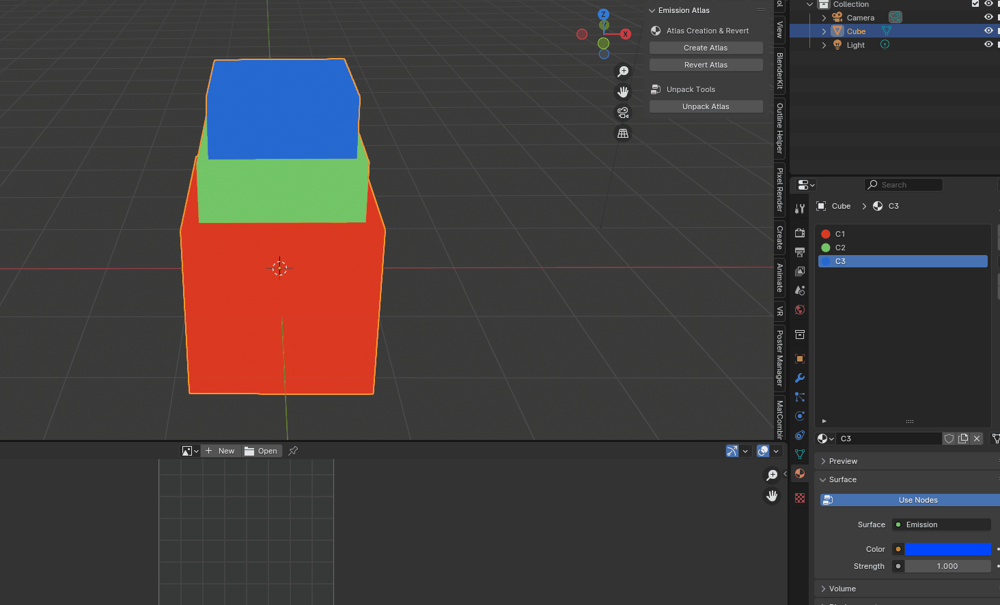

# Emission Texture Atlas Generator for Blender

A Blender addon that converts simple emission materials into a single texture atlas. It comes with built-in operators to **create the atlas**, **revert** the changes, and **unpack** the atlas back into individual single-color emission materials. The addon adds a dedicated panel in the 3D View's N-panel.

_What's the point?_
I've found myself frequently using single-colour Emission materials in Blender. However, having many materials on one object is usually not preferable for exporting to game engines, sites like Sketchfab, etc. This simple tool helps speed up the process of atlasing this specific type of material setup.



## Features

- **Create Atlas:**
  - Detects simple, single-color emission materials on selected mesh objects.
  - Generates a single-row texture atlas with one column per material.
  - Remaps UVs so that every face samples the correct column from the atlas.
  - Replaces original materials with a unified atlas material.

- **Revert Atlas:**
  - Restores the original materials for selected objects (as long as the original data is still in memory).

- **Unpack Atlas:**
  - Analyzes the atlas image by sampling each column.
  - Creates new single-color emission materials for each column.
  - Reassigns faces to the new materials based on their UV coordinates.

- **N-Panel**
  - Access features through the N-panel.

## Installation

1. **Download the Addon:**
   - Download the latest release ZIP.
   - Or, clone the repository or download the repository as a ZIP file:
     ```bash
     git clone https://github.com/your_username/emission-texture-atlas.git
     ```

3. **Install in Blender:**
   - Open Blender.
   - Go to **Edit → Preferences → Add-ons**.
   - Click **Install...** and select the downloaded ZIP file or the `emission_atlas_extended.py` file.
   - Enable the addon by checking the box next to its name.

## Usage

1. **Open the N-Panel:**
   - In the 3D View, press **N** to open the side panel.
   - Switch to the **"Emission Atlas"** tab.

2. **Create Atlas:**
   - Select the mesh objects you want to process.
   - Click the **"Create Atlas"** button.
   - The addon will generate a texture atlas, remap the UVs, and replace the materials with the unified atlas material.

3. **Revert Atlas:**
   - To restore the original materials (if available), select your objects and click the **"Revert Atlas"** button.

4. **Unpack Atlas:**
   - To reverse the atlas generation (without using the stored original materials), select your objects and click the **"Unpack Atlas"** button.
   - The addon will read the atlas image, create new single-color materials, and reassign faces based on their UV coordinates.

## Code Structure

- **`emission_atlas_extended.py`**
  - Contains all the addon code including:
    - Utility functions for creating the atlas, remapping UVs, and generating materials.
    - Operator classes for converting to an atlas, reverting changes, and unpacking the atlas.
    - A panel class that integrates these features into the 3D View's N-panel.
  - Global storage (`ORIGINAL_MATERIALS`) is used to temporarily hold original material data for reverting.

## Development

- **Modifying the Addon:**
  - The global dictionary `ORIGINAL_MATERIALS` holds the original materials; note that it is only persistent during the current Blender session.
  - Custom properties (e.g., `"atlas_columns"`) are stored on the atlas image to facilitate unpacking.
  - The addon automatically unregisters previous instances when re-running the script to avoid duplicate entries in the menu.

- **Contributing:**
  - Contributions are welcome! Please fork the repository and open a pull request with your improvements.

## License

This project is licensed under the [MIT License](LICENSE).

## Acknowledgments

Thanks to the Blender community.


